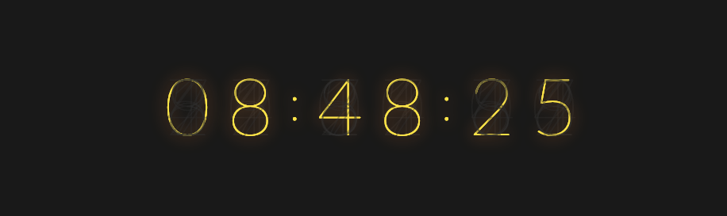
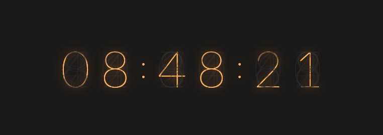

# [nixie-clock](http://test.bentswanson.com/nixie)

#### Forked from [https://github.com/qwerji/nixie-clock](https://github.com/qwerji/nixie-clock)

> A JavaScript clock imitating [Nixie tubes](https://en.wikipedia.org/wiki/Nixie_tube).

Changed from clock to timer.

## Example Yellow (default)

## Example Orange
Add the class `clock-orange`.

